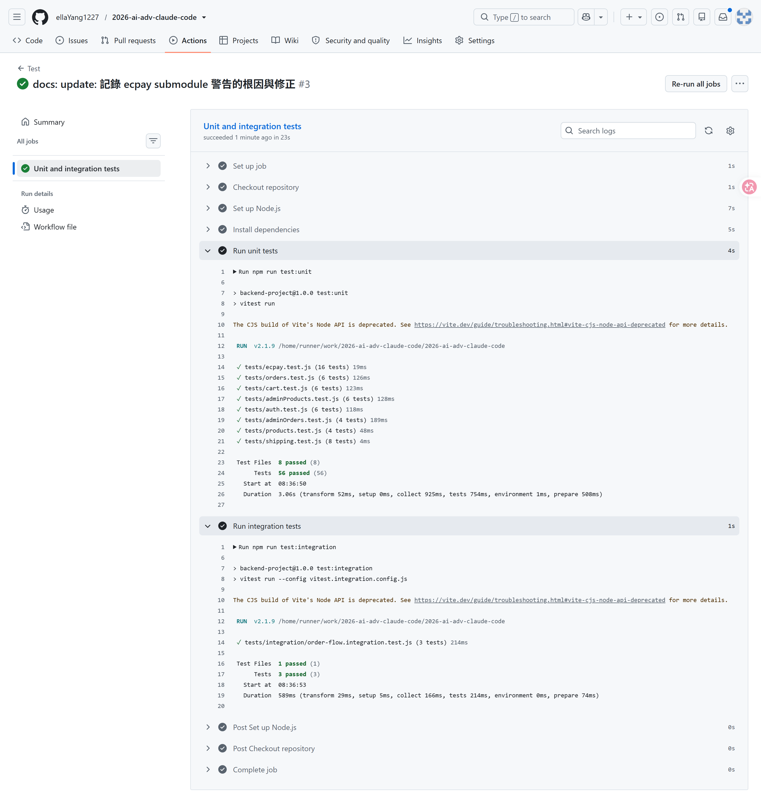

# GitHub Actions CI 紀錄

Workflow 定義於 [`.github/workflows/test.yml`](../../.github/workflows/test.yml)，於 `push` / `pull_request` 時觸發，依序執行：

1. Checkout 專案
2. 安裝 Node.js 20（含 npm 快取）
3. `npm ci` 安裝依賴
4. `npm run test:unit`（56 個測試案例）
5. `npm run test:integration`（3 個測試案例，使用獨立暫存 DB）

不執行 Playwright E2E Test，也不會另外啟動前端或後端服務。

---

## 執行成功截圖

`Unit and integration tests` job 全綠燈，56 個 Unit Test 與 3 個 Integration Test 皆通過。
